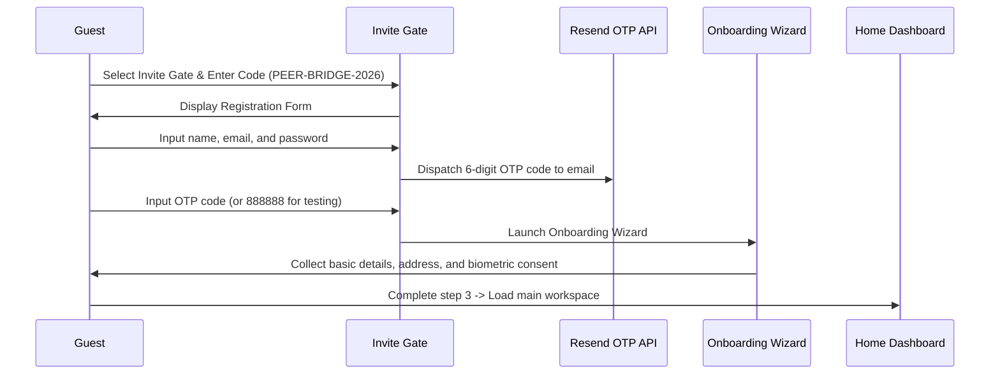

# Peer Bridge: Comprehensive Product & Features User Guide

Welcome to the official user guide for the **Peer Bridge Private Capital Ecosystem**. This manual provides step-by-step operating instructions for all user-facing capabilities built into the platform.

---

## 1. Demo Credentials Registry

Peer Bridge is an exclusive, invitation-only platform. For testing and verification, you can select one of the preloaded demo accounts below from the dropdown on the **Member Sign-In** panel. All preloaded accounts use the universal security password:

> [!IMPORTANT]
> **Universal Demo Password:** `password123`

### Demo Profiles & Role Mappings

| Member Name | Email Address | Primary Platform Role | Sector Permissions / Details |
| :--- | :--- | :--- | :--- |
| **Sarah Connor** | `sarah@skynet-rebel.io` | Investor & Entrepreneur | Vetted Investor, CleanTech Founder (*EcoSphere*) |
| **Mohit Mehra** | `mohit@mehraventures.com` | Investor (P2P Lender) | Debt specialist ($50,000 wallet limit) |
| **Kristi Tonin** | `kristi@toninlogistics.com` | Entrepreneur (Borrower) | Logistics Founder (*Tonin Logistics*, $500 note request) |
| **Marcus Vance** | `marcus@vancegroup.ai` | Compliance Affiliate / GP | Accredited CPA & Attorney (All 4 sectors approved) |
| **Elena Rostova** | `elena@rostova.ai` | Investor / AI Founder | Thin FICO file candidate, approved via cash-flow bypass |
| **Devon Lane** | `devon@auroratech.io` | CleanTech Founder | CleanTech Founder (*Aurora Energy Systems*) |
| **Clara Hsin** | `clara@hsin-law.com` | Professional Affiliate | Securities Lawyer & Crowd SPV Consultant |
| **Kofi Anan** | `kofi@helium-energy.com` | Entrepreneur | Idea-stage CleanTech founder |

---

## 2. Onboarding, Waitlist & Registration Process

The entry gate supports invitation checkouts, email liveness verification, and onboarding setup.



### Step-by-Step Registration Flow
1. **Invite Gate Checkout**: On the landing page, select **Invite Gate**, enter the code `PEER-BRIDGE-2026`, and click **Verify**.
2. **Account Creation**: Fill in your Name, Email, Password, and select your initial platform perspective (e.g. Investor, Entrepreneur, or Affiliate). Click **Verify Email**.
3. **OTP Verification**: The system dispatches a 6-digit verification code to your email using the Resend API. Input the code to verify your email.
   * *Developer Note*: If local api keys are not configured, use the sandbox bypass code `888888`.
4. **Onboarding Wizard**: Upon successful registration, the wizard guides you through:
   * **Step 1: Bio & Listings**: Select directory tags, headline summaries, and biometric liveness agreements.
   * **Step 2: Company Setup**: If registered as an Entrepreneur, configure your initial company details (incorporation, share price, valuation) to initialize your private cap table.
   * **Step 3: Accreditations**: Complete initial identity disclosures.

---

## 3. The Core Workspace & Home Dashboard

The home dashboard is split into three primary columns designed to balance navigation, focus, and collaboration.

```
+------------------+----------------------------------+-------------------+
|  PROFILE CARD    |   CENTRAL HUB MODULE             |   ACTIVE NETWORK  |
|  Status Ring     |                                  |                   |
|                  |   • P2P Marketplace Listings     |   • Peer Listings |
|  RESOURCES       |   • Underwriting Cash Sync       |   • Chat Cockpit  |
|  • Wallet link   |   • AI Agent Hub                 |   • Message Box   |
|  • Tax link      |   • Document Vault               |                   |
|                  |                                  |                   |
+------------------+----------------------------------+-------------------+
```

### Left Sidebar: Profile & Resource Cockpit
* **Interactive Profile Card**: Displays your active avatar, name, headline, and the circular **Verification Ring** indicating KYC compliance levels.
* **⚙️ Edit Profile / Settings CTA**: Instantly links to the Profile and Compliance settings panel.
* **Secondary Resources**: Collapsible menu providing access to Saved placements, Events calendars, and Help portals.

### Central Workspace: Active Modules
* Navigating the top header tabs switches the central workspace module between:
  * **Ecosystem Home** (Lending Marketplace & Directory)
  * **Founder Hub** (Entrepreneur AP & Chore delegations)
  * **Advisory Hub** (Affiliate list and task claims)
  * **Secure Document Vault** (KYC credentials checks)
  * **AI Agents Hub** (Underwriting simulations)

### Right Sidebar: Network Cohort & Messages
* **Ecosystem Cohort**: Displays recently active members on the platform.
* **Chat Cockpit**: Floating LinkedIn-style chat boxes at the bottom-right corner. Click any peer in the directory or cohort to initiate an encrypted direct messaging thread.

---

## 4. KYC Status & Vetting Center (Vault)

The **Secure Document Vault** (`DocumentModule.js`) manages your verification status. Completing checks lights up the corresponding quadrant of your profile status ring:

```
           [1] IDENTITY (Green: Verified / Cyan: Email Vetted)
                      \   /
       [4] CAPITAL     \ /     [2] PROFESSIONAL
      (Emerald Green)  / \     (Royal Purple)
                      /   \
           [3] ACADEMIC (Indigo Blue)
```

### Vetting Quadrants & How to Clear Them
1. **Identity Quadrant (1)**: Glows green when government ID scans and facial biometric checks are verified.
2. **Professional Quadrant (2)**: Glows purple upon successful work history verification. Input your corporate email (e.g. `kristi@toninlogistics.com`), receive a verification code, and input the code to lock in the badge.
3. **Academic Quadrant (3)**: Glows indigo when you upload your degree diploma. The system simulates background validation.
4. **Capital Quadrant (4)**: Glows emerald green when net worth assets exceed the SEC Reg D Accredited Investor threshold.
   * Input asset classes (Cash cash balances, Investment assets, and Real Estate liabilities).
   * The calculator evaluates: $\text{Assets} - \text{Liabilities} \ge \$1,000,000$.

---

## 5. Connections & Directory Search

Locate and connect with peers, founders, and compliance advisors in the global directory.

### Operating Instructions
1. Navigate to **Ecosystem Home** -> **Network Directory** sub-tab.
2. Toggle search category tabs: **Vetted Members** (People), **Investment Offerings**, or **Accredited Advisors**.
3. Use the filter controls:
   * **Global Search Box**: Matches by name, headline tag, or specific skills.
   * **Location Filter**: Type country or state names (e.g. `Germany` or `NY`) to locate members under specific legal jurisdictions.
   * **Sector Filter**: Select specific specialties (e.g. *CleanTech*, *DeepTech*, *SaaS*).
   * **Credentials Filter**: Check boxes to only display members matching specific quadrants (e.g. only *ID Verified* or *Accredited*).
4. **Symmetric Connections**: Click **Request Connection** on a member's card. Once established, click **Message** to open the chat widget.
5. **Real-time DM Chat**: Input text and press Enter. The interface displays blue chat bubbles for your outgoing messages and light-grey bubbles for incoming peer replies.

---

## 6. P2P Debt & SAFE Equity Marketplace

Browse and invest in active debt syndicates and venture rounds.

### Operating Instructions
1. Go to **Ecosystem Home** -> **Active Placement Listings**.
2. Filter listings by **All**, **Equity Campaigns**, or **Debt campaigns**.
3. Review campaign specifications:
   * **Venture Equity (SAFE)**: Shares Price, Minimum Investments, and pre-money Valuation Targets.
   * **P2P Debt Notes**: Target Yield (% APY), Tenor/Term duration, and minimum principal bounds.
4. **Fractional Escrow Contributions**:
   * Click **Invest / Place Capital** on a campaign card.
   * Input your investment amount.
   * Confirm the transaction. The system deducts the sum from your banking wallet, deposits it into the target project's escrow, and updates the campaign progress bar and the company's cap table allocations in real-time.

---

## 7. Bureau Bypass Underwriting System

Bypass traditional credit bureau files by connecting payroll and bank feeds to establish cash flow reliability.

### Operating Instructions
1. Navigate to **Profile & Settings** -> **Payroll & Cash Flow Sync**.
2. Click **Connect ADP / Paychex**:
   * Review authorization details.
   * Click **Authorize Connect** to simulate W-2 and withholding extractions.
3. Click **Connect Plaid Bank Feed**:
   * Confirm account authorizations.
   * Click **Link Account** to sync discretionary and mandatory expenditure logs.
4. Verify the green **PAYROLL_API_INTEGRATED** and **PLAID_CASHFLOW_AUDITED** badges appear in your dashboard header.
5. The system automatically computes your **Behavioral Risk Score (BRS)** based on your liquid surplus margins.

---

## 8. Founder Hub (Founder Pro)

A dashboard containing accounts payable forecasting, SEC preparations, and project delegations.

### Operating Instructions
1. Go to the **Founder Hub** tab.
2. **Accounts Payable AP Automation**:
   * Review your cash runway meter (e.g. *8.5 Months Stable*).
   * View outstanding bills. Click **Pay Invoice** on bills (e.g., legal retainers or advisory retainers) to settle them from your escrow wallet.
3. **Chore & Task Delegation Wizard**:
   * Click **Add Task**, input title (e.g., *SEC Form C Compliance Audit*), select an Affiliate (e.g., *Sarah Jenkins, Esq.*), and set the escrow bounty split (e.g., *$300*).
   * Click **Delegate & Escrow Split** to lock the bounty in escrow and dispatch the task.
4. **SEC Form C Prep**:
   * Review automatically compiled sections (Issuer info, Financial condition data, and Cap Table Allocations).
   * Click **Review & Finalize Form C** to view the ready-to-file SEC registration document.

---

## 9. Advisory & Affiliate Hub

A hub for lawyers, CPAs, and compliance advisors to locate contracts, assist startup projects, and earn fees.

### Operating Instructions
1. Navigate to **Advisory Hub**.
2. Review the list of accredited advisors.
3. Locate **Assigned Project Compliance Chores**:
   * Under the chores board, view tasks delegated to you by founders.
   * Click **Accept Task** to review details.
   * Upon completing the review, click **Mark Complete & Claim Escrow**:
     * The locked escrow bounty is instantly cleared and deposited into your banking wallet balance.
4. **Content Resource Center**:
   * Scroll to the content grid. Click **Upload Legal/Tax Resource** to share templates and articles with the community, earning reputation badges.

---

## 10. Wallet, Banking & Tax Documents

Access transaction lists and tax records inside the **Profile** card.

### Sub-tab Navigation
1. Go to **Profile** -> click **💳 Wallet & Banking** or **🧾 Tax Center** in the subnav.
2. **Wallet & Banking Operations**:
   * View your current **Escrow Wallet Balance** and **Available Cash balance**.
   * Review the ledger of deposits, investments, AP payouts, and affiliate chore credits.
3. **Form 1099-INT Tax Compiler**:
   * Select a tax year (e.g., **2026 Tax Season**) from the dropdown.
   * View compiled interest payouts from your debt placements.
   * Click **View IRS Form 1099-INT** to open the interactive IRS-compliant overlay pre-populated with Box 1 interest income, EIN numbers, and withholding masks.

---

## 11. AI Agent Hub & Negotiation Simulator

Phase 3 introduces autonomous agents to assist in P2P note pricing negotiations.

### Operating Instructions
1. Go to the **AI Agents Hub** tab.
2. Review active agent nodes:
   * **CapitalAgent (Investor AI)**: Bids on startup offerings based on ARR.
   * **FounderAgent (Borrower AI)**: Sets borrow APRs matching BRS cash flows.
   * **AuditAgent (Affiliate AI)**: Runs background KYC verification scans.
3. Select your target startup candidate from the dropdown (e.g., *Elena Rostova*, *Kristi Tonin*, or *Devon Lane*).
4. Click **Initialize Autonomous Negotiation Session**:
   * Watch the conversation play out as the entrepreneur agent and investor agent trade APR interest rate counter-offers.
5. If terms converge, the system outputs a signed **Promissory Note Certificate** complete with principal parameters, APR, and a unique **SHA-256 Cryptographic Agreement Hash**.
6. If terms fail to converge (e.g. for *Devon Lane* due to high lifestyle cash burn), the simulator halts the signature loop and logs a decline report.

---

## 12. Biometric Consent, Skip Biometrics & Privacy Settings

Manage your data rights and privacy parameters inside the onboarding wizard or profile dashboard.

### Biometric Consent Gate & Skip Option
* Before scanning passports, licenses, or taking selfies on desktop or mobile, you must check **"I agree to the Biometric Vetting & Storage Terms"** on the agreement block.
* To skip biometric collection, click **"Skip Biometric ID Scanning & Proceed ➔"**. Your registration will complete using standard address/SSN validation, leaving the Biometric ID badge disabled.

### Privacy & Data Sovereignty Center
1. Go to **Profile** settings -> expand the **"🛡️ Privacy & Compliance"** card.
2. Perform compliance actions:
   * **Access My Data**: Click **"📥 Download My Data Ledger (JSON)"** to compile and download a copy of all your database records.
   * **Opt-Out of Data Sharing**: Check the box next to **"Opt-Out of Data Sharing"** to exclude your profile from directory searches.
   * **Right to Erasure (Delete Account)**: Click **"⚠️ Permanently Erase My Account & Data"** and confirm. The system executes a compliance purge, deleting all your local files, localStorage tokens, and database documents permanently.
