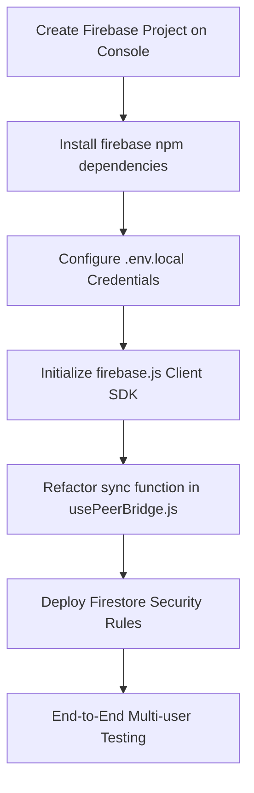

# Implementation Plan: Connections, Notifications, P2P Chat, & Real Database Path

This implementation plan details the frontend interactive features (Connections filter, P2P Connect button, Notifications Dropdown, and floating LinkedIn-style Chat widget) and lays out the transition path to a real backend database (Firebase Cloud Firestore).

---

## 1. Immediate Interactive P2P Features (Frontend)

We will modify `usePeerBridge.js`, `page.js`, and `src/app/components/ProfileModule.js` to implement these systems with responsive client-side persistence in local storage first, ensuring everything works dynamically.

### Component-Level Adjustments

#### 1. A. Global State Changes ([usePeerBridge.js](file:///Users/sridhargs/Documents/Antigravity/peer-bridge/src/app/usePeerBridge.js))
* **Directory Filters**: Add `directoryRoleFilter` and `setDirectoryRoleFilter` state (default `'All'`).
* **Connection Storage**: Update the `toggleConnectionNode` action to save the updated `connections` array using the `sync` utility (writing `pb_connections` to local storage). Read this state on mount so connections persist across page reloads.
* **Initial Notifications**: Seed `notifications` with 3 highly realistic start-up/regulatory alerts (SEC Form C sync, Biometrics vetting, Connection accepted by Marcus Vance).
* **Unread Notifications Badge**: Add an unread notification count.

#### 1. B. Network Directory & Global Search Connect Buttons ([ProfileModule.js](file:///Users/sridhargs/Documents/Antigravity/peer-bridge/src/app/components/ProfileModule.js) & [page.js](file:///Users/sridhargs/Documents/Antigravity/peer-bridge/src/app/page.js))
* **Dropdown Option**: Add `"🤝 My Connections Only"` filter to the directory dropdown.
* **Connection Filtering**: In the Network Directory tab, filter members based on `directoryRoleFilter`. If the filter is `'Connections'`, filter out members whose `customer_id` is NOT in `state.connections`.
* **Connect Toggle**: Place a `Connect` / `Connected` toggle button in both:
  * Directory Member Cards (`ProfileModule.js`)
  * Search Results Cards (`page.js`)
* Clicking this button adds/removes the member from the connections array, updates the left sidebar count in real-time, and triggers an in-app biometrics notification.

#### 1. C. Header Notifications Center ([page.js](file:///Users/sridhargs/Documents/Antigravity/peer-bridge/src/app/page.js))
* **Notifications Bell 🔔**: Place a bell icon in the top header next to the Wallet. Render a red numeric badge displaying the number of unread notifications.
* **Notifications Dropdown**: Toggling the bell opens a sleek glassmorphic overlay (`styles.notificationDropdown`) listing the chronological notifications. Clicking `✕` clears a specific alert, and a button allows clearing all alerts.

#### 1. D. LinkedIn-Style Floating Messaging Hub ([page.js](file:///Users/sridhargs/Documents/Antigravity/peer-bridge/src/app/page.js))
* **Floating Widget**: Render a fixed floating bar at `bottom: 0`, `right: 30px`, `z-index: 9999` with a minimized title: `💬 P2P Messaging Hub`.
* Clicking the title expands the widget to a height of `420px`.
* **Active Connections Selector**: Inside the expanded chat, display your active connection nodes (e.g. Marcus Vance, Dr. Evelyn Chen, Sarah Jenkins, Esq.).
* Clicking any node opens a P2P messaging interface with:
  * Scrollable chat bubble list
  * Message input box and Send button
* **Smart Automated AI Responders**: When a message is sent, display it in the bubble list, and trigger a `setTimeout` response after **1 second** simulating an instant response from that node based on their professional background:
  * **Marcus Vance**: Responds to capital structures, SEC Form C compliance, and investor cap tables.
  * **Dr. Evelyn Chen**: Responds to bio-engineered photo-bioreactor sleeve engineering, carbon offset scaling, and CleanTech.
  * **Sarah Jenkins, Esq.**: Responds to securities placements, Crowd SPV limits, and Reg CF legal boundaries.
* Store conversation threads in local state and synchronize them to local storage under `pb_chats` so they persist!

---

## 2. Path to a Real Database (Firebase Firestore)

To support real-time multi-user operations (e.g., when Elina logs in and sends a connection request, Sarah Connor sees it immediately on her own machine), we propose implementing a **real-time backend database**. 

### Why Firebase Cloud Firestore?
1. **Serverless Architecture**: Cloud Firestore can be queried directly from client-side Next.js code using the Firebase Client SDK.
2. **Real-time Synchronization**: Firestore listeners (`onSnapshot`) push updates in real-time—ideal for P2P notifications and instant messaging.
3. **Seamless Integration**: We can easily refactor our `sync` function in `usePeerBridge.js` to write to Firestore collections instead of local storage.

### Proposed Database Schema

We will structure Firestore with 11 primary collections matching the app's tables:
1. `customers` (customer profile metadata)
2. `basic_profiles` (DOB, address, bio, profile photo)
3. `professional_profiles` (Headline, experience, education, skills)
4. `investor_profiles` (Investor type, range, preferred industries)
5. `entrepreneur_profiles` (Company name, funding goal, valuation, summary)
6. `campaigns` (Active deal-flow rounds, amount raised, cap table)
7. `portfolio` (Holds active equity share investments)
8. `connections` (Mapping arrays of customer IDs representing linked nodes)
9. `notifications` (System, compliance, and P2P connection alerts)
10. `chats` (P2P DMs, subcollection `messages` structured chronologically)
11. `help_tickets` (Support requests)

### Step-by-Step Database Migration Plan

> [!NOTE]
> Setting up the database requires credentials. You will need to create a free project at [Firebase Console](https://console.firebase.google.com/) and provide us with the configuration object (or place it in a `.env.local` file).

---

## 3. Verification Plan

### Automated Verification
* Run `npm run build` locally to ensure a 100% successful Next.js build compilation with zero warnings or errors.

### Manual Verification Flow
1. **Connections Filtering**: Click "Connections" in the sidebar. Verify the Network Directory dropdown is set to "My Connections Only" and displays exactly your connections.
2. **Connect Actions**: Run a search for a member. Click `➕ Connect`. Verify:
   * The sidebar Connections count increments instantly.
   * A Biometrics notification triggers.
   * The button label changes to `🤝 Connected`.
   * Clicking `🤝 Connected` disconnects them and updates the count.
3. **Notifications Center**: Toggle the Bell 🔔. Clear an individual notification or clear all alerts.
4. **Messaging Hub**: Open the bottom-right chat, click Marcus Vance, and send: *"Hi Marcus, what is the SEC crowdfunding SPV limit?"*. Verify your message appears, and Marcus replies with a realistic SEC limit explanation after 1 second.
