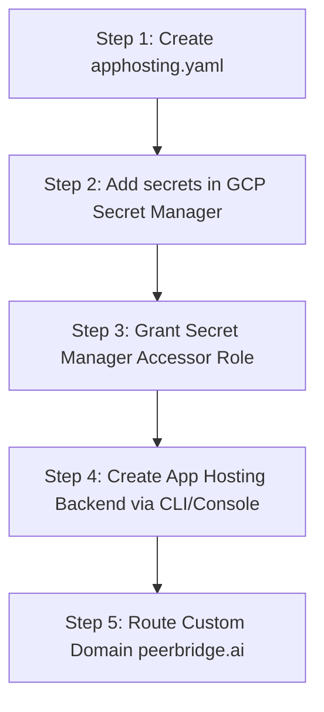

# Implementation Plan: Vercel to Firebase App Hosting Migration

This plan details the steps required to migrate **peerbridge.ai** (Next.js SSR application) from Vercel hosting to **Firebase App Hosting**. Firebase App Hosting is Google's serverless solution designed specifically for SSR frameworks, provisioning serverless Cloud Run containers that scale down to zero when inactive.

---

## User Review Required

> [!IMPORTANT]
> **Firebase Project & GCP Billing (Blaze Plan) Requirement:**
> Because Firebase App Hosting utilizes enterprise-grade Google Cloud resources (Cloud Run, Cloud Build, and Secret Manager) behind the scenes, it requires your Firebase project to be on the pay-as-you-go **Blaze Plan** (with credit billing enabled).
> * **Expected Cost:** Under 50 users, your usage will fall entirely within the GCP/Firebase free tier limits, meaning your actual monthly cost will be **$0.00**.
> * **Access:** You will need owner permissions on the Google Cloud / Firebase console to link your GitHub repository.

---

## Open Questions

> [!IMPORTANT]
> Please review the following details before approving:
> 1. **Firebase Project ID:** What is your active Firebase Project ID? (e.g., `peer-bridge-production` or similar). We will need this to initialize the backend configuration.
> 2. **GCP Billing/Blaze Plan:** Is your Firebase Project already upgraded to the Blaze Plan? If not, we will need to pause during the setup to let you enable billing.
> 3. **Secret Manager Setup:** Since API keys (like `GEMINI_API_KEY`) must be secured via GCP Secret Manager for App Hosting, do you have your Gemini API key ready to paste into the Secret Manager console?

---

## Proposed Changes

We will introduce a new configuration file and verify Next.js parameters before initiating the deployment hooks.

### Configuration Layer

#### [NEW] [apphosting.yaml](file:///Users/sridhargs/Documents/Antigravity/peer-bridge/apphosting.yaml)
Create a new file in the root directory to define the build environment, static cache headers, and runtime secrets:

```yaml
# apphosting.yaml
# App Hosting configuration file for Next.js SSR

headers:
  - glob: "**/*.@(js|css|png|jpg|jpeg|gif|svg|ico|webmanifest)"
    headers:
      - key: Cache-Control
        value: public, max-age=604800, immutable

# Secrets are securely injected from Google Cloud Secret Manager at build/runtime
secrets:
  - name: GEMINI_API_KEY
    secret: gemini_api_key_secret
```

#### [MODIFY] [next.config.mjs](file:///Users/sridhargs/Documents/Antigravity/peer-bridge/next.config.mjs)
Ensure that the Next.js config does **NOT** contain `output: 'export'`, as Firebase App Hosting must build standard Server-Side Rendering (SSR) bundles.

---

## Deployment & Setup Pipeline

Once the plan is approved, we will execute the migration along the following workflow:



### Step 1: Create `apphosting.yaml`
Write the config file to the root workspace.

### Step 2: Set Up Secrets in Google Cloud Secret Manager
1. Open the [Google Cloud Console](https://console.cloud.google.com/) for your project.
2. Go to **Security ➔ Secret Manager**.
3. Create a new secret named `gemini_api_key_secret`.
4. Add a new version containing your actual **Gemini API Key** as the value.

### Step 3: Grant IAM Access to App Hosting Service Account
During build time, the Firebase App Hosting service account needs permission to read the secret we just created:
1. Identify the default App Hosting service account name. It typically looks like:
   `firebase-app-hosting@<PROJECT_ID>.iam.gserviceaccount.com`
2. Under Secret Manager, select the `gemini_api_key_secret` checkbox.
3. Click **Show Info Panel ➔ Add Principal**.
4. Paste the service account address.
5. Select the role **Secret Manager Secret Accessor** (`roles/secretmanager.secretAccessor`) and click **Save**.

### Step 4: Create the App Hosting Backend
We can set this up via the Firebase Console Web UI:
1. Go to the [Firebase Console](https://console.firebase.google.com/).
2. Select your project and click **Build ➔ App Hosting**.
3. Click **Get Started** and connect your GitHub account.
4. Select the `peer-bridge` repository and choose the `main` branch.
5. Complete the setup to create the backend. Firebase will automatically install GitHub webhooks, triggering a new build on every subsequent `git push`.

### Step 5: Transition the DNS Records (peerbridge.ai)
Once the build is complete:
1. In the Firebase App Hosting dashboard, click **Connect Custom Domain**.
2. Add `peerbridge.ai` (and `www.peerbridge.ai`).
3. Firebase will provide new DNS records (A/TXT).
4. Go to your domain registrar (GoDaddy, Namecheap, etc.) and replace your old Vercel A/CNAME records with the new Firebase configurations.
5. Within 1-2 hours, Firebase will auto-provision a new SSL certificate, and your site will be live!

---

## Verification Plan

### Automated Checks
* Run `npm run build` locally to confirm the project builds without Next.js compile errors.

### Manual Verification
* Access the generated Firebase deployment URL (e.g., `https://backend-id.us-central1.run.app` or `<app-name>.web.app`).
* Test the **AI Negotiation Simulator** to confirm that the serverless API routes correctly fetch the `GEMINI_API_KEY` secret from GCP Secret Manager and communicate with the Gemini model successfully.
* Verify that static assets (like the bull logo icon) and custom fonts render immediately with cache-control headers active.
