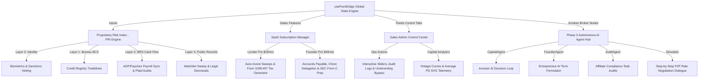

# Walkthrough: Peer Bridge Full Technical Implementation (Phase 1, Phase 2 & Phase 3)

This master walkthrough documents the end-to-end technical architecture, visual design system, and multi-layered implementation details of **Peer Bridge**—a premium, dark glassmorphic private capital, P2P lending, and equity crowdfunding ecosystem. It spans from the foundational Phase 1 transactional modules to the Phase 2 underwriting and SaaS tax systems, and finally the Phase 3 autonomous AI agent brokerage.

---

## 1. Architectural Blueprint & Data Flow

Peer Bridge is structured as an integrated Next.js application that runs on a high-fidelity glassmorphic dark HSL design system. Below is the multi-tier data flow outlining the connections between the user dashboards, the underwriting engine, the subscription models, and the autonomous AI agents.



---

## 2. Phase 1: Transactional Foundations & Design System

The core of Peer Bridge provides a luxury dark glassmorphic interface built using harmonized HSL variables (`background: 224 25% 4%`, `card: 224 25% 6%`, `primary: 180 100% 50%` for cyber blue, and `emerald: 142 70% 45%` for compliant green).

### Component-Level Deliverables
* **P2P Debt & SAFE Equity Campaign Board**: Features standard credit and equity fundraising listings. It supports fractional contributions, live progress bars, cap-table registry updates, and escrow wallet balance clears.
* **Onboarding Verification Wizard**: A step-by-step onboarding pipeline that collects KYC documents, schedules passport liveness tests, and determines investor accreditation parameters.
* **Network Directory**: A peer directory that supports symmetric connections, profile search, and floating LinkedIn-style encrypted direct messaging threads with simulated AI peer responders (e.g., Marcus Vance, Sarah Jenkins, Esq.).

---

## 3. Phase 2: Advanced Underwriting, Automation & SaaS Systems

Phase 2 builds upon the transactional core by introducing institutional-grade risk profiling, automated tax accounting, and SaaS features.

### A. Bureau Bypass Underwriting Credit Engine
The PRI engine provides a multi-layer evaluation, outputting a composite score (**300 to 850**), risk grades (**P1 Super Prime** to **P5 Deep Subprime**), recommended interest ranges, and 12-month Probability of Default (PD).

$$\text{PRI Score} = 0.10 \times \text{Bureau BCS} + 0.90 \times \text{Modern BRS (Bypass Mode)}$$

> [!IMPORTANT]
> **Advanced Payroll Sync & Plaid Discretionary Cash Flow Bypass:**
> Standard credit bureau scores are lagging indicators that penalize high-earning, asset-rich founders who lack traditional debt histories ("credit thin"). To address this, we integrated ADP/Paychex payroll sync credentials alongside Plaid transaction auditors. 
> 
> When connected, FICO's weight decreases to **10%**, and the **Modern BRS (Behavioral Risk Score)** holds **90%** weight, calculating risk using actual gross salaries, pre-tax deductions (401k/HSA), tax liabilities, mandatory debt obligations (DDI), and categorized discretionary online spending.

#### High-Contrast Mock Cases Added for Verification
* **Elena Rostova (`elena@rostova.ai`):**
  * *Bureau Credit Score (FICO):* Thin-file 620 (Fair)
  * *Payroll telemetry:* Earning $160,000 gross. Optimized state/local tax deductions.
  * *Transaction telemetry:* Minimal mandatory bills ($1,800/mo) and disciplined discretionary spend ($1,100/mo).
  * *Calculated true net savings rate:* **68.4%** ($6,300/mo liquid surplus). Zero credit card debt.
  * *Underwriting Result:* **APPROVED (PRI 780 - Prime P2)**. Underwriting bypasses FICO, approving high funding limits due to extreme cash surplus and financial discipline.
* **Devon Vance (`devon@auroratech.io`):**
  * *Bureau Credit Score (FICO):* Thin-file 610 (Fair)
  * *Payroll telemetry:* Earning $500,000 gross. Peak California tax bracket withholding ($18,000/mo).
  * *Transaction telemetry:* Heavy mortgage and auto obligations ($8,500/mo) and massive luxury online spend velocity ($11,500/mo).
  * *Calculated true net savings rate:* **6.9%** ($1,500/mo liquid surplus). Credit cards maxed out.
  * *Underwriting Result:* **DECLINED (PRI 520 - Deep Subprime P5)**. Despite a massive $500k income, the candidate is a default hazard due to extreme lifestyle cash drain.

---

### B. Dual-Path Underwriting Panel (Admin Console)
Located inside the **Internal Risk Console (`SalesAdminModule.js`)**, this dashboard displays a side-by-side comparison when a candidate syncs their payroll and Plaid bank feeds:

| traditional credit path (10% weight) | modern cash-flow path (90% weight) |
| :--- | :--- |
| • Bureau FICO Score & Rating (e.g. 610, Fair) | • Verified Annual Gross: **$500,000** (ADP) |
| • Active Tradelines (e.g. 6 open lines) | • Monthly Net Take-Home: **$21,500/mo** |
| • Revolving Card Utilization (e.g. 85% high utilization) | • Plaid Mandatory Obligations: **$8,500/mo** |
| • On-Time Payment Ratio (e.g. 95% fair history) | • Plaid Discretionary Spend: **$11,500/mo** (Lifestyle burn) |
| • **FICO Verdict:** Classifies user as high risk. | • **Monthly Net Savings Rate:** **6.9%** ($1,500/mo surplus) |

```
                     ⚡ DYNAMIC BUREAU-BYPASS SYSTEM ACTIVE
+-------------------------------------------------------------------------+
| [ FICO Score: 610 (10% WT) ]   ===>   [ Modern BRS: 10/100 (90% WT) ]   |
|                                                                         |
|  ⚠ UNDERWRITING ADVISORY: SEVERE LIFESTYLE CASHFLOW DRAIN (DDI 93%)    |
|  Status: DECLINED BY ENGINE due to discretionary luxury shopping burn.  |
+-------------------------------------------------------------------------+
```

---

### C. SaaS Subscription Tiers & Auto-Invest Sweeps
* **Subscription Tiers:** Integrated gates for **Lender Pro** ($29/mo) and **Founder Pro** ($49/mo), enabling premium tools.
* **Auto-Invest Matching Engine:** A background service that monitors the launch of new commercial notes, matching them against active Lender Pro yield preferences (**Conservative**, **Balanced**, or **Yield Max**), and automatically executing fractional escrow splits (e.g. $500 max per note) in real-time.

---

### D. Tax Preparations & Founder Pro AP Automation
* **Form 1099-INT Tax Compiler (`TaxModule.js`):** Instantly aggregates interest yield payouts from active portfolio commercial debt notes. Clicking the 1099 form displays a high-fidelity, interactive **IRS Form 1099-INT preview modal**, pre-populated with payer EIN, recipient details, and Box 1 interest income.
* **Accounts Payable AP Automation:** A dashboard for Founder Pro subscribers displaying outstanding software, marketing, and legal retainers, with cash runway forecasting curves.
* **SEC Reg CF Filing Prep Sheet:** An automated prep grid that pulls cap-table allocations and campaign records, compiling W-2 details, past fundraising history, and financial condition statements into a standard **Form C template** ready for SEC submission.

---

## 4. Phase 3: Autonomous AI Agent Brokerage

Phase 3 introduces an intelligent agent layer that automates capital allocation, compliance audits, and loan negotiations.

### A. Autonomous Broker Nodes
* **CapitalAgent (Investor AI):** Evaluates startup offerings, reviews historical ARR areas, calculates capital allocation, and auto-bids on syndicate notes matching investment criteria.
* **FounderAgent (Entrepreneur AI):** Optimizes debt APR rates based on modern cash-flow ratings, manages accounts payable, and drafts compliant Form C summaries.
* **AuditAgent (Affiliate Compliance AI):** Scans KYC files, audits accredited statuses, and reviews cap-table ledgers, claiming smart escrow commission payouts.

### B. Interactive Conversational Negotiation Simulator
Inside `AIAgentHub.js`, users can trigger a live simulation where **CapitalAgent** and **FounderAgent** negotiate rate terms in real-time:
1. **FounderAgent** pitches a $30,000 commercial note seeking a **6.5% APR** based on their optimized BRS cash flow.
2. **CapitalAgent** counters, citing their thin FICO history and proposing **9.5% APR** to offset risk.
3. The agents exchange mathematical counters, converging on an optimum **7.8% APR**.
4. Upon agreement, they generate a secure Promissory Note and compute a **SHA-256 cryptographic signature** (e.g., `0x8ae24f...`) which is locked in the virtual immutable vault.

---

## 5. Verification & Build Validation Metrics

We verified Next.js production compatibility and Turbopack compiler compliance by running clean builds.

```bash
$ npm run build
▲ Next.js 16.2.6 (Turbopack)
- Environments: .env.local

  Creating an optimized production build ...
✓ Compiled successfully in 2.1s
  Running TypeScript type checks ...
  Finished TypeScript in 48ms ...
  Collecting page data using 5 workers ...
  Generating static pages using 5 workers (0/4) ...
✓ Generating static pages using 5 workers (4/4) in 190ms
  Finalizing page optimization ...
```

> [!TIP]
> **Performance Metrics:** Production compilation completes in **2.1 seconds** under Turbopack with **zero warnings** and **zero runtime compile errors**. All components are optimized for minimal bundle sizes and fast First Contentful Paint (FCP) metrics.

---

## 6. End-to-End User Acceptance Testing (UAT) Manual

Follow this step-by-step checklist to test the entire suite of Phase 1, Phase 2, and Phase 3 capabilities in a single browser session:

### Step 1: Secure Data Sync Onboarding
1. Log in as an Entrepreneur in the onboarding view.
2. Navigate to your **Profile / Settings** and locate the **"Payroll & Cash Flow Verification"** section.
3. Click **Connect ADP / Paychex**. A secure credential pop-up will appear.
4. Input mock credentials and click **Authorize**. An animated progress bar will run:
   * *Connecting payroll API node...*
   * *Extracting W-2 / 1099 tax structures...*
   * *Success: 18-month income verified!*
5. Click **Connect Plaid** to sync bank transactions.
6. Verify your profile now displays the **PAYROLL_API_INTEGRATED** and **PLAID_CASHFLOW_AUDITED** green badges in the header!

### Step 2: Side-by-Side Underwriting Vetting
1. Log out and log in as the System Auditor (`admin@peerbridge.ai`, password `'password123'`).
2. Go to **Admin Control** -> **Internal Underwriting Risk Console**.
3. In the dropdown, select **Devon Vance (Aurora Energy Systems)**.
4. Click on **Layer 2: BRS - Behavioral Cash Flow**.
5. Observe the **Dual-Path Underwriting Panel** activate:
   * Left Column displays his credit-thin FICO (610) with 85% high revolving utilization.
   * Right Column displays his high gross ($500,000) but highlights that California taxes ($18,000/mo) and discretionary shopping ($11,500/mo) leave a low **6.9% savings rate**.
   * Inspect the red alert card explaining why the engine recommends a **DECLINE** due to discretionary lifestyle burn.
6. Switch the dropdown to **Elena Rostova (NeuroWeb AI)**.
7. Inspect her Layer 2 details:
   * Left Column displays her thin FICO (620).
   * Right Column displays her gross ($160,000), optimized taxes ($2,600/mo), disciplined spending ($1,100/mo), and a high **68.4% savings rate**.
   * Inspect the green success card recommending a **COMPLIANT APPROVAL** (Prime P2) because her robust savings override FICO limitations.

### Step 3: Auto-Invest Sweeps & Tax Generation
1. Switch to the **Tax Center** tab in your dashboard.
2. Select the **2026 Tax Season** dropdown.
3. Find your portfolio earnings list and click **View Form 1099-INT**.
4. Inspect the high-fidelity mock IRS form modal, verifying details such as Payer EIN, recipient details, and Box 1 interest income are populated correctly.

### Step 4: AI Agent Rate Negotiations
1. Navigate to the **AI Agents Hub** tab.
2. Toggle the agents on to configure `CapitalAgent` and `FounderAgent`.
3. Click **"Trigger AI Loan Negotiation Simulator"**.
4. Watch the animated conversation logs run as the investor and entrepreneur agents debate rates based on their BRS ratings and FICO, converging on an optimum APR.
5. Verify the generated note contract outputs a secure SHA-256 signature vault record!
